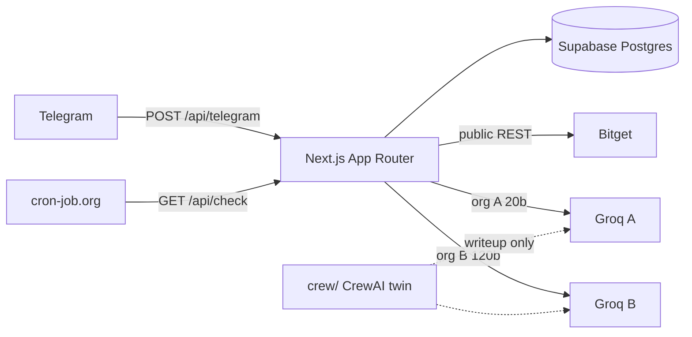

# Rook

Rook is an AI trading desk that doesn't just build a thesis — it tries to destroy it before you put money behind it. Then it watches the invalidation after the cash session.

Telegram: [@getrookbot](https://t.me/getrookbot)

Bitget AI Base Camp Hackathon S2 · track **AI Trading Desk** (Personalized Research Workbench / Decision Stress Testing).

Rook **never places an order**. Not financial advice. Human decision only.

## What it does

- Persistent reply keyboard (Sentry-style): NEW THESIS / MY WATCHES / LAST REPORT / CHECK NOW / SETTINGS / HELP
- Inline flows for horizon, side, market
- Deterministic Bitget public scout (last, 24h, realized vol, SMA20)
- Groq org A: news + combined bull/bear
- Groq org B: Judge JSON (invalidation, confidence, action)
- Watches in Supabase; cron path is price-vs-invalidation first, Judge only when the line is crossed, CHECK NOW/REFRESH, or a >5% move
- CALL OFF closes the watch and alerts the human

Bare tickers like `NVDA` normalize to `NVDAUSDT`, then `RNVDAUSDT` (Bitget rToken-style) if the first ticker 404s.

## Architecture



CrewAI lives in `crew/` for the writeup. Production routes do not import `crewai`.

## Env

| Variable | Purpose |
| --- | --- |
| `TELEGRAM_BOT_TOKEN` | BotFather token for `@getrookbot` |
| `TELEGRAM_WEBHOOK_SECRET` | Compared to `X-Telegram-Bot-Api-Secret-Token` |
| `SUPABASE_URL` | Project URL |
| `SUPABASE_SERVICE_ROLE_KEY` | Server only. Bypasses RLS |
| `GROQ_API_KEY_A` | Bull / Bear / News (`openai/gpt-oss-20b`) |
| `GROQ_API_KEY_B` | Judge (`openai/gpt-oss-120b`, fallback 20b) |
| `GROQ_MODEL_A` | Default `openai/gpt-oss-20b` |
| `GROQ_MODEL_B` | Default `openai/gpt-oss-120b` |
| `CRON_SECRET` | Header `x-cron-secret` on `/api/check` |
| `BITGET_BASE` | Default `https://api.bitget.com` |

See `.env.example`.

## Local

```bash
cp .env.example .env.local
npm install
npm test
npm run dev
```

Health: `http://localhost:3000/api/health`

Webhook routes force the Node runtime (`maxDuration = 60`).

## Supabase

1. Create a project
2. SQL editor → paste `supabase/migrations/001_rook.sql` → run
3. Copy project URL + **service role** key into Vercel env
4. RLS denies `anon` and `authenticated`; only the service role is used on the server

## Vercel

1. Import this GitHub repo
2. Framework: Next.js
3. Paste every env var
4. Deploy
5. Confirm `GET https://<vercel>/api/health`

### Webhook

```bash
curl "https://api.telegram.org/bot${TELEGRAM_BOT_TOKEN}/setWebhook?url=https://<vercel>/api/telegram&secret_token=${TELEGRAM_WEBHOOK_SECRET}"
```

### Cron

cron-job.org (or similar) every 15 minutes:

- URL: `https://<vercel>/api/check`
- Method: GET
- Header: `x-cron-secret: <CRON_SECRET>`

User SETTINGS stores 15m / 1h / 4h as a preference only. The job is still external.

## CrewAI twin

```bash
cd crew
python3 -m venv .venv
source .venv/bin/activate
pip install -r requirements.txt
python crew.py BTCUSDT 7d decide
```

## Test checklist

```bash
npm test
BASE=https://<vercel> CRON_SECRET=... bash scripts/test-matrix.sh
```

In Telegram:

1. `/start` — keyboard appears
2. NEW THESIS → 7d → YOU DECIDE → BTC
3. Read card → BULL CASE / BEAR CASE / I AM WRONG IF
4. WATCH THIS
5. MY WATCHES / LAST REPORT
6. CHECK NOW
7. CALL OFF
8. TYPE SYMBOL with a bogus ticker — should health-check BTCUSDT and say not found

## Hackathon notes

- Track: Desk / decision stress testing
- No execution path exists in this repo
- Two Groq organisations for independent rate limits
- Buttons and persistent keyboard follow the Sentry UX (`BTN` map, MAIN MENU everywhere)
- MIT license

## License

MIT © 2026 Rook contributors
